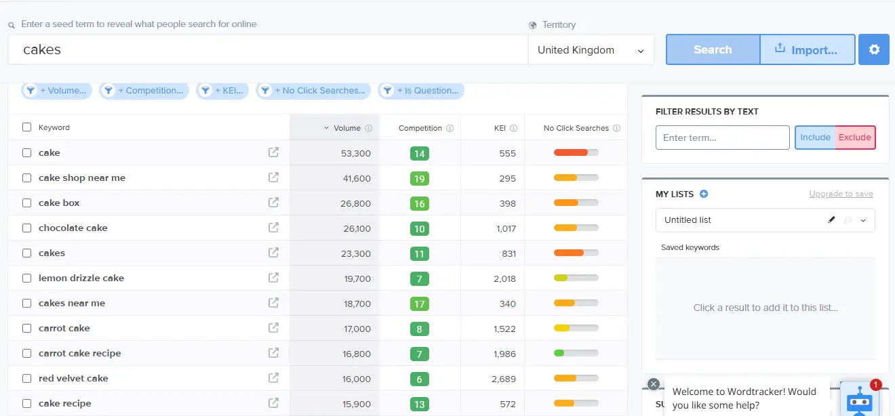
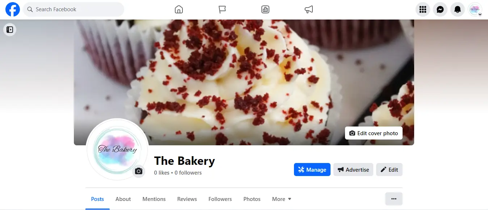

# Table of Contents

- [Keyword Research](#keyword-research)
- [SEO Improvements](#SEO-Improvements)
- [Marketing Strategies](#marketing-strategies)
  - [Product](#product)
  - [Price](#price)
  - [Promotion](#promotion)
  - [Place](#place)
- [Facebook Page](#facebook-page)
- [Newsletter](#newsletter)

## Keyword Research

Cake related keywords were brainstormed at the beginning of the marketing plan for this site. 
Please see table below for keywords brainstorming session.

| Cakes            | Birthday Cake | Drizzle Cake    |
|------------------|---------------|-----------------|
| Cupcakes         | Sponges       | Artisan         |
| Celebration Cake | Dublin Bakery | Home-made Cakes |
| Sweet Treats     | Bakery        | Desserts        |
| Apple Tarts      | Pastry        |                 |

These words were then put into the Wordtracker site to test for popularity and competition.

## SEO Improvements

To improve Search Engine Optimisation of the site, meta tags were added in the head of the base template. 
These included a site description and a list of relevant keywords. 

A sitemap was generated and included.

A robots.txt file was generated to control where search engine bots could visit in the site.

## Marketing Strategies

The Bakery is a small B2C artisan bakery business, wishing to expand their online presence. Their web marketing strategy was designed keeping in mind the 4 P's of marketing.

### Product

The Bakery sells homemade cakes and baked goods through their online store. These products are quality cakes and this is highlighted in the design of the site. The colour scheme of the site matches the business branding but the background tones in the main body section of the pages are kept muted, to better allow the product images stand out and grab the users attention.

### Price

The Bakery's products are competitively priced. When designing the product pages, it was important to ensure the price points are clearly displayed during each stage of the e-shopping process.

### Promotion

The Bakery provides an ongoing promotion of free delivery for orders above €50. This information is included on a banner that is displayed at the top of all pages across the site to encourage users to spend more to gain free shipping.

### Place

The Bakerys chosen place of distribution is online. The site was designed with ease of use in mind, and eye catching product images. The home page features a promotional banner, and a carousel of attention grabbing product images to entice the user to stay and browse through the site. The site is designed to intuitively guide the user through to the checkout with ease from start to finish to encourage sales.
A facebook page was also designed to enhance the business online offering by garnering a social media presence. It is a great place to interact with potential users and guide them to the website to complete a sale.

## Facebook Page

The Facebook page was designed to match the branding and style of the website so that The Bakery's online presence is consistent and appears trustworthy, quality and genuine.

## Newsletter

A Mailchimp Newsletter SignUp option is also included on the site footer to encourage users to register for a newsletter. Newsletters are a great way to keep online brands to the front of users minds and send users relevant promotions and/or business information.

