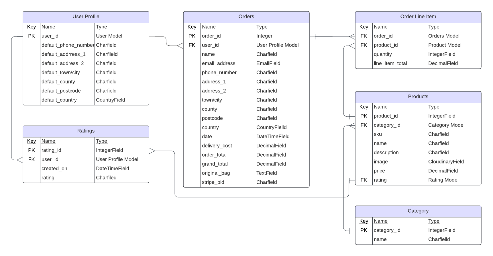

# The Bakery

The Bakery is a fictional B2C ecommerce website that specializes in selling homemade baked goods to online consumers.

# Table Of Content

- [User Experience](#user-experience)
  - [User Stories](#user-stories)
- [Design](#design)
  - [ERD](#erd)
  - [Wireframes](#wireframes)

## User Experience

### User Stories

Developer:

- As a developer I want to ensure sensitive information is stored safely.
- As a developer I want to create models for the functionality of the site, and to ensure data gets saved correctly to the database.
- As a developer I want to create a base template including navbar and footer for other pages to inherit from.
- As a developer I want to deploy the site to heroku so others can use the site
- As a developer I want to complete a README.

Site Owner:

- As a Site Owner I want to sell baked goods online.
- As a Site Owner I want to be able to contain deliveries to within a chosen geographical area.
- As a Site Owner I want to be able to require a minimum order amount to qualify for free delivery.
- As a Site Owner I want to have card payments handled securely.
- As a Site Owner I want to be able to add/remove and edit my goods with ease.
- As a Site Owner I want to receive an email notification letting me know an order has been made.
- As a Site Owner I want my website to appear in the top results of search engines like Google.

Site User:

- As a Site User I want to view goods to buy online.
- As a Site User I want to see a detailed view of a single item to buy.
- As a Site User I want to see user reviews of goods.
- As a Site User I want to see an image and price of the goods for sale.
- As a Site User I want to use a searchbar to easily find specific goods.
- As a Site User I want to be able to filter search results.
- As a Site User I want to be able to customize my order such as adding a message.
- As a Site User I want to be abe to learn more about the business.
- As a Site User I want to be able to read the business terms and conditions.
- As a Site User I want to be able to read the business privacy policy.
- As a Site User I want to be able to contact the business with any queries.
- As a Site User I want to create an account.
- As a Site User I want to view my previous orders.
- As a Site User I want to receive email confirmation of my order.
- As a Site User I want to save my billing and shipping information for future use.
- As a Site User I want to securely save my card details for future use.
- As a Site User I want to be able to edit or delete my personal details.
- As a Site User I want to be able to reset my password should I forget it.

## Design

### ERD

### Wireframes

- Products Wireframe

- Products Detail Wireframe

- Checkout Wireframe

