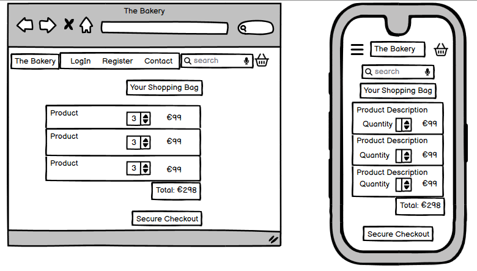

# The Bakery

[The Bakery](https://the-bakery-7e15a3228766.herokuapp.com/)is a fictional B2C ecommerce website that specializes in selling homemade baked goods to online consumers.

# Table Of Content

- [Business Ecommerce Model](#business-ecommerce-model)
- [User Experience](#user-experience)
  - [User Stories](#user-stories)
- [Design](#design)
  - [ERD](#erd)
  - [Wireframes](#wireframes)
  - [Fonts](#fonts)
  - [Colour Scheme](#colour-scheme)
- [Development](#development)
  - [Agile Methodology](#agile-methodology)
    - [EPICS(Milestones)](#epics---milestones)
  - [Technologies Used](#technologies-used)
- [Features](#features)
  - [Flow of the Website](#flow-of-the-website)
  - [Create Account](#create-account)
  - [User Profiles](#user-profiles)
  - [Social Interactions](#social-interactions)
  - [CRUD](#crud)
  - [Product Management](#product-management)
- [Testing](#testing)
- [Deployment](#deployment)
  - [Clone the Repository](#clone-the-repository)
  - [Fork the Repository](#fork-the-repository)
  - [Heroku](#heroku)
- [Credits](#credits)
  - [Content](#content)
  - [Code](#code)
  - [Acknowledgements](#acknowledgements)

## Business Ecommerce Model

## User Experience

### User Stories

Site Owner:

- As a Site Owner I want to be able to add/remove and edit my goods with ease.
- As a Site Owner I want my website to appear in the top results of search engines like Google.

Site User:

- As a Site User I want to view goods to buy online.
- As a Site User I want to see a detailed view of a single item to buy.
- As a Site User I want to see user reviews of goods.
- As a Site User I want to see an image and price of the goods for sale.
- As a Site User I want to use a searchbar to easily find specific goods.
- As a Site User I want to be able to learn more about the business.
- As a Site User I want to be able to contact the business with any queries.
- As a Site User I want to create an account.
- As a Site User I want to view my previous orders.
- As a Site User I want to receive email confirmation of my order.
- As a Site User I want to save my shipping information for future use.
- As a Site User I want to be able to delete my personal details.
- As a Site User I want to be able to raise any issues I have with my orders.
- As a Site User I want to be able to add comments about products.
- As a Site User I want to be able to delete my comments.
- As a Site User I want to be able to delete my account.
- As a Site User I want to be able to delete my ratings.

## Design

### ERD

### Wireframes

- Products Wireframe

- Products Detail Wireframe

- Products Detail Ratings and Comments Section

- Checkout Wireframe

### Fonts

### Colour Scheme

## Development

### Agile Methodology
This project was developed using the Agile methodology. All epics and user stories progress was tracked through Github projects Kanban Board.

#### Epics(Milestones)

Epic 1: Initial Setup

- As a developer, I need to create the base.html template, including navbar and footer so that other pages can reuse the layout
- As a developer I need to create an env.py file to store sensitive data for security reasons.
- As a developer, I need to create a static folder so that images, css and javascript work on the website
- As a developer, I need to set up the models so that the websites main functions will work
- As a developer I need to set up the admin file so that I can test the backend functionality

Epic 2: User Authentication

- As a developer, I need to set up the Sign Up page using django-allauth.
- As a developer, I need to set up the Sign in page using django-allauth.
- As a developer, I need to set up the Sign out page using django-allauth.
- As a site owner, I would like the sites authentication pages to be styled to match the websites theming.
- As a user, I would like to be able to create my own account.
- As a user, I would like to be able to delete my account in the future if I wish.
- As a user, I would like to be able to sign in and sign out with ease.

Epic 3: Shopping

- As a Site User I want to view goods to buy online.
- As a Site User I want to see a detailed view of a single item to buy.
- As a Site User I want to see user reviews of goods.
- As a Site User I want to see an image and price of the goods for sale.
- As a Site User I want to use a searchbar to easily find specific goods.
- As a Site Owner I want to be able to add products to sell easily.
- As a Site Owner I want to be able to edit or remove products when necessary.

Epic 4: Checkout

- As a Site User I want to view my previous orders.
- As a Site User I want to receive email confirmation of my order.
- As a Site Owner I want to ensure my orders go through without issue.
- As a developer I need to set up webhooks to ensure Stripe creates orders if there is an error on our site.

Epic 5: User Profiles

- As a Site User I want to save my shipping information for future use.
- As a Site User I want to be able to view my previous orders.
- As a Site user I want to be able to send feedback about my orders.
- As a Site User I want to be able to delete my personal details.
- As a Site User I want to be able to set a primary delivery address.
- As a Site User I want to be able to delete my account.

Epic 6: Social Interactions

- As a Site User I want to be able to add comments about products.
- As a Site User I want to be able to delete my comments.
- As a Site User I want to be able to rate and review the products.
- As a Site User I want to be able to delete my ratings.
- As a Site User I want to be able to contact the business.
- As a Site User I want to see their social sites.

Epic 7: Deployment

- As a developer, I need to deploy the project to heroku so that users can visit and use the site.
- As a developer I need to ensure all sensitive information is stored in an env file so they are secure.
- As a developer I need to ensure that debug is set to false before deployment to prevent compromising the site.

Epic 8: Documentation

- As a developer I want to create the README.

### Technologies Used

- Python
- HTML
- CSS
- GitHub
- GitPod
- Git
- Heroku
- Cloudconvert
- Favicon.io
- Am I responsive
- Font Awesome
- Bootstrap5
- Google Fonts
- CI Python Validator
- HTML - W3C HTML Validator
- CSS - Jigsaw CSS Validator
- Javascrpt - JSHint
- TablesGenerator
- Chrome Dev Tools
- Cloudinary
- LightHouse
- Whitenoise
- Django
- Stripe

## Features

### Flow of the Website

### Create Account

### User Profiles

### Social Interactions

### CRUD

### Product Management

## Testing

Due to the large size of the testing section, I created a separate file to store all the tests and results. It can be found here [TESTING.md]()

## Deployment

The site was deployed to GitHub pages. The steps to deploy are as follows:

- In the GitHub repository, navigate to the Settings tab
- From the source section drop-down menu, select the Main Branch
- Once the main branch has been selected, the page will be automatically refreshed with a detailed ribbon display to indicate the successful deployment.
- The live link can be found here - [The Bakery live site](https://the-bakery-7e15a3228766.herokuapp.com/)

### Clone the Repository

- Navigate to the GitHub Repository you want to clone to use locally:

- Click on the code drop down button

- Click on HTTPS

- Copy the repository link to the clipboard

- Open your IDE of choice (git must be installed for the next steps)

- Type git clone copied-git-url into the IDE terminal

The project will now of been cloned on your local machine for use.

### Fork the repository

For creating a copy of the repository on your account and change it without affecting the original project, useFork directly from GitHub:

- On My Repository Page, press Fork in the top right of the page

- A forked version of my project will appear in your repository

### Heroku

The project was deployed using Code Institutes mock terminal for Heroku

Deployment steps:

- Fork or clone this repository.

- Ensure the Procfile is in place.

- Create a new app in Heroku

- Select "New" and "Create new app"

- Name the new app and click "Create new app"

- In "Settings" select "BuildPack" and select Python and Node.js. (Python must be at the top of the list)

- Whilst still in "Settings", click "Reveal Config Vars" and input the required hidden variables.

- Click on "Deploy" and select your deploy method and repository

- Click "Connect" on selected repository.

- Either choose "Enable Automatic Deploys" or "Deploy Branch" in the manual deploy section

- Heroku will now deploy the site

## Credits

### Content

Product content was provided by Rob & Steves Confectioners Ltd.

### Code

- The code in this project was inspired by Code Institutes walkthrough project Boutique Ado
- Inspiration was taken from a previous project for the comment structure.
- Inspiration was also taken from Pyplanes youtube tutorials and Stack Overflow to develop the star rating functionality

### Acknowledgements

- Thank you, as always, to my mentor Narender Singh for his guidance and patience in developing this project.
- Thank you to Marko from CI for answering my numerous queries.
- Thank you to tutor support for all their help on getting this project functional.
- Thank you to all those on slack who answered my questions at various stages of development.
- Thank you to my family and friends for their extensive testing of the finished site.