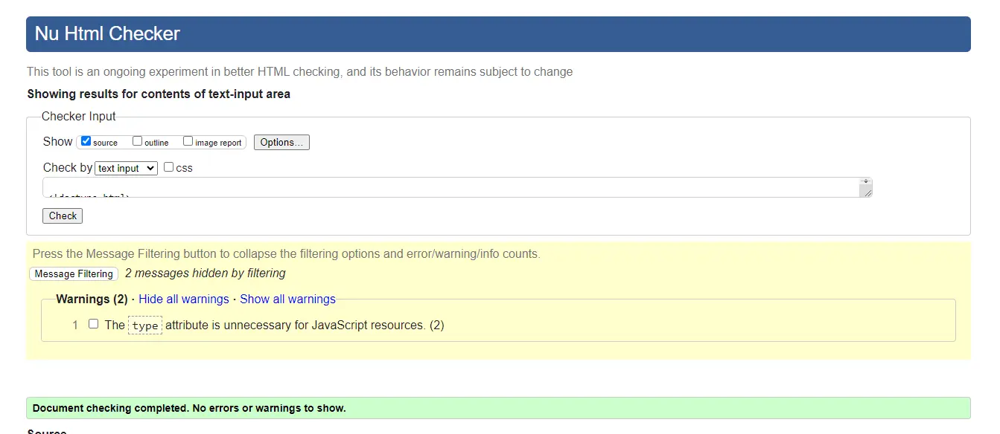
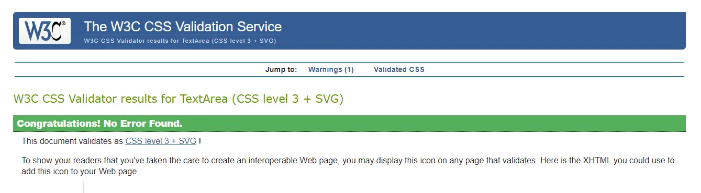
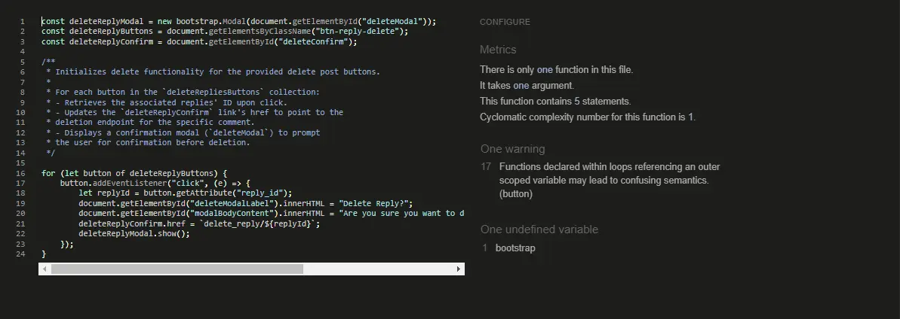
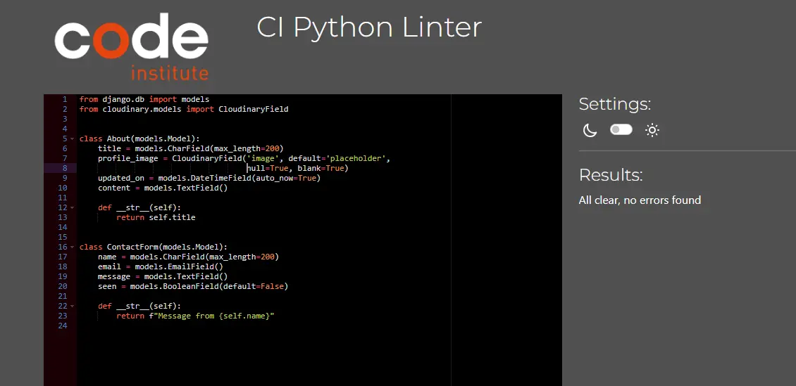
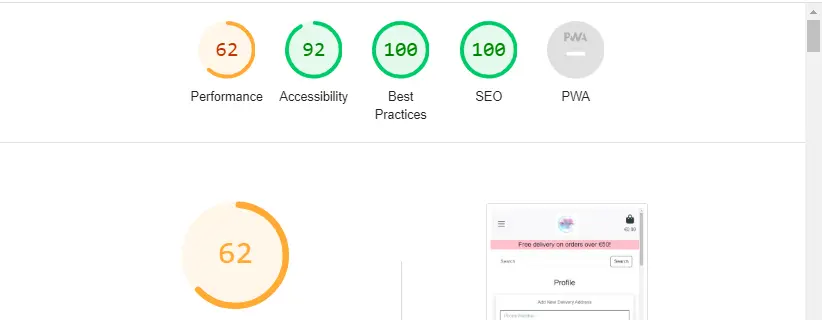

# Table of Contents

- [User Story Testing](#user-story-testing)
- [Code Validation](#code-validation)
  - [HTML](#html)
  - [CSS](#css)
  - [JavaScript](#JavaScript)
  - [Python](#python)
- [Responsiveness](#Responsiveness)
- [Browser Testing](#browser-testing)
- [Device Testing](#device-testing)
- [Lighthouse](#Lighthouse)
- [Manual Testing](#manual-testing)
  - [Site Navigation](#site-navigation)
  - [Home Page](#home-page)
  - [About Page](#about-page)
  - [Product Management Page](#product-management-page)
  - [Sign Out Page](#sign-out-page)
  - [Profile Page](#profile-page)
  - [Saved Addresses Page](#saved-addresses-page)
  - [Create Account Page](#create-account-page)
  - [Sign In Page](#sign-in-page)
  - [All Products Page](#all-products-page)
  - [Whole Cakes Page](#whole-cakes-page)
  - [Cupcakes Page](#cupcakes-page)
  - [Cake Slices Page](#cake-slices-page)
  - [Product Detail Page](#product-detail-page)
  - [Edit Product Page](#edit-product-page)
  - [Shopping Bag Page](#shopping-bag-page)
  - [Checkout Page](#checkout-page)
  - [Checkout Success Page](#checkout-success-page)
  - [Delete Modal](#delete-modal)
- [Bugs](#bugs)

## User Story Testing

Site Owners:

| User Story                                                                                      | Test                                                                                                                                              | Result |
|-------------------------------------------------------------------------------------------------|---------------------------------------------------------------------------------------------------------------------------------------------------|--------|
| - As a Site Owner I want to be able to add/remove and edit my goods with ease.                  | Site owners/superusers can add products, edit them and delete them through the use of forms and delete buttons easily on the front end            | PASS   |
| - As a Site Owner I want my website to appear in the top results of search engines like Google. | SEO techniques are employed on the site including keywords, and ensuring quality information is provided. Sitemap and robot.txt file also present | PASS   |

Site Users:

| User Story                                                                    | Test                                                                                                                                      | Result |
|-------------------------------------------------------------------------------|-------------------------------------------------------------------------------------------------------------------------------------------|--------|
| As a Site User I want to view goods to buy online.                            | Site is intuitively designed to guide users to products to buy, beginning with carousel on home page with links to product page           | PASS   |
| - As a Site User I want to see a detailed view of a single item to buy.       | User can click on a product of interest to view more details of chosen product                                                            | PASS   |
| - As a Site User I want to see user reviews of goods.                         | User can see other users reviews in the product detail page                                                                               | PASS   |
| - As a Site User I want to see an image and price of the goods for sale.      | Product Price and image is displayed on both product page and the product detail page, also the shopping bag and checkout pages           | PASS   |
| - As a Site User I want to use a searchbar to easily find specific goods.     | Searchbar is included just below navbar on all pages to allow users easily search the site at all times                                   | PASS   |
| - As a Site User I want to be abe to learn more about the business.           | About page provides details about the business                                                                                            | PASS   |
| - As a Site User I want to be able to contact the business with any queries.  | About page provides a contact form and there is also a link to it in the footer on all pages for ease of access                           | PASS   |
| - As a Site User I want to create an account.                                 | Users can create account by clicking the create account button in the navbar account dropdown                                             | PASS   |
| - As a Site User I want to view my previous orders.                           | users can view previous orders via the profile page in the account dropdown menu                                                          | PASS   |
| - As a Site User I want to receive email confirmation of my order.            | upon checkout users are sent an email confirming their order                                                                              | PASS   |
| - As a Site User I want to save my shipping information for future use.       | users can add delivery addresses in the profile page and toggle them as primary. Primary addresses are used to populate the checkout form | PASS   |
| - As a Site User I want to be able to delete my personal details.             | Users can delete their addresses via the address page in the profile section                                                              | PASS   |
| - As a Site User I want to be able to raise any issues I have with my orders. | users can submit feedback via the feedback form in the profile page                                                                       | PASS   |
| - As a Site User I want to be able to add comments about products.            | users can comment under products on the product detail page                                                                               | PASS   |
| - As a Site User I want to be able to delete my comments.                     | users can delete their comments via the delete button on the comment card                                                                 | PASS   |
| - As a Site User I want to be able to delete my account.                      | users can delete their accounts via the delete link on the profile page                                                                   | PASS   |
| - As a Site User I want to be able to delete my ratings.                      | users can delete their reviews via the delete button on the review card                                                                   | PASS   |

## Code Validation

### HTML

All HTML pages were run through the [W3C HTML Validator](https://validator.w3.org/). See results in below table.

| Page             | Result |
|------------------|--------|
| Home             | PASS   |
| About            | PASS   |
| Profile          | PASS   |
| Sign In          | PASS   |
| Sign Out         | PASS   |
| Create Account   | PASS   |
| Checkout         | PASS   |
| Checkout Success | PASS   |
| Products         | PASS   |
| Product Detail   | PASS   |
| Whole Cake       | PASS   |
| Cupcakes         | PASS   |
| Cake Slices      | PASS   |
| Saved Addresses  | PASS   |

### CSS

The CSS stylesheet was run through the [W3C CSS Validator](https://jigsaw.w3.org/css-validator/)

Test Results CSS: PASS

### JavaScript

The Javascript files in this project were run through [JSHint](https://jshint.com/). See table below for results.

| Page           | Result |
|----------------|--------|
| Delete Account | PASS   |
| Delete Comment | PASS   |
| Delete Rating  | PASS   |
| Delete Reply   | PASS   |
| Delete Product | PASS   |
| Delete Address | PASS   |

### Python

Python files were tested using the [CI Python Linter](https://pep8ci.herokuapp.com/#). See table below for results.

| Page             | Result |
|------------------|--------|
| views-about      | PASS   |
| urls-about       | PASS   |
| forms-about      | PASS   |
| models-about     | PASS   |
| urls-bag         | PASS   |
| views-bag        | PASS   |
| forms-checkout   | PASS   |
| models-checkout  | PASS   |
| urls-checkout    | PASS   |
| views-checkout   | PASS   |
| urls-home        | PASS   |
| views-home       | PASS   |
| urls-products    | PASS   |
| views-products   | PASS   |
| forms-products   | PASS   |
| models-products  | PASS   |
| urls-profiles    | PASS   |
| views-profiles   | PASS   |
| models-profiles  | PASS   |
| forms-profiles   | PASS   |
| urls-the bakery  | PASS   |
| views-the bakery | PASS   |

## Responsiveness

Throughout development, constant testing was done using Chrome Developer to test the sites responsiveness to different device widths.

Further testing was also done on real mobile devices to confirm the site is rendering as expected.

| Device             | Responsiveness | Result |
| ------------------ | -------------- | ------ |
| iPhone11           | Excellent      | PASS   |
| Samsung Galaxy A13 | Excellent      | PASS   |
| Samsung Galaxy a51 | Excellent      | PASS   |
| Samsung Galaxy a14 | Excellent      | PASS   |

## Browser Testing

The deployed site was tested on multiple browsers to confirm that everything is working as expected.

| Browser        | Appearance | Functionality | Result |
| -------------- | ---------- | ------------- | ------ |
| Chrome         | Excellent  | As expected   | PASS   |
| Microsoft Edge | Excellent  | As expected   | PASS   |
| Firefox        | Excellent  | As expected   | PASS   |
| Safari         | Excellent  | As expected   | PASS   |

### Lighthouse

The site was tested for performance and accessibility using Lighthouse on Chrome Developer Tools. It is noted that carousel images are hindering performance.

## Manual Testing

### Navigation Menu

| Element                            | Action  | Expected Behaviour                                | Result |
|------------------------------------|---------|---------------------------------------------------|--------|
| Home Link                          | Click   | Redirects to Home page                            | PASS   |
| About Link                         | Click   | Redirects to About page                           | PASS   |
| Account Dropdown                   | Click   | Opens dropdown with links to account pages        | PASS   |
| Create Account Link                | Click   | Redirects to Create Account page                  | PASS   |
| Sign In Link                       | Click   | Redirects to Sign In page                         | PASS   |
| Product Management Link            | Click   | Redirects to Add a Product page                   | PASS   |
| Sign Out Link                      | Click   | Redirects to Sign Out Page                        | PASS   |
| My Profile Link                    | Click   | Redirects to Profile Page                         | PASS   |
| Shop Dropdown Link                 | Click   | opens dropdown with links to product pages        | PASS   |
| All Products Link                  | Click   | Redirects to page displaying all products         | PASS   |
| Whole Cakes Link                   | Click   | Redirects to page displaying whole cakes category | PASS   |
| Cupcakes Link                      | Click   | Redirects to page displaying cupcakes category    | PASS   |
| Cake Slices Link                   | Click   | Redirects to page displaying cake slices category | PASS   |
| Hamburger Menu                     | Click   | Displays a dropdown list of all navbar links      | PASS   |
| Sign Up Link                       | Display | Displays for non-authenticated users              | PASS   |
| Sign In Link                       | Display | Displays for non-authenticated users              | PASS   |
| Sign Out Link                      | Display | Displays for authenticated users only             | PASS   |
| Product Management Link            | Display | Displays for superusers only                      | PASS   |
| My Profile Link                    | Display | Displays for authenticated users only             | PASS   |
| Bag Icon Link                      | Click   | Redirects to the shopping bag page                | PASS   |
| Bag Icon Link                      | Hover   | Highlights on hover to indicate a link            | PASS   |
| Bag Content € Amount               | Display | Displays current bag total                        | PASS   |
| Footer Socials                     | Click   | Opens relevant social page in new tab             | PASS   |
| Footer Socials                     | Hover   | Highlights on hover to indicate a link            | PASS   |
| Footer Contact Us Link             | Click   | Redirects to the about page                       | PASS   |
| Footer Contact Us Link             | Hover   | Highlights on hover to indicate a link            | PASS   |
| Footer Newsletter Form             | Display | Displays for non-authenticated users              | PASS   |
| Footer Newsletter Subscribe Button | Click   | Submits the newsletter form to mailchimp          | PASS   |
| Search Bar Button                  | Click   | Returns results of search query                   | PASS   |

### Home Page

| Element               | Action  | Expected Behaviour                  | Result |
|-----------------------|---------|-------------------------------------|--------|
| Carousel Slider       | Display | Displays 3 pictures in rotation     | PASS   |
| Carousel Slider Links | Hover   | Highlight on hover to indicate link | PASS   |
| Carousel Slider Links | Click   | Redirects to the products page      | PASS   |

### About Page

| Element           | Action  | Expected Behaviour                         | Result |
|-------------------|---------|--------------------------------------------|--------|
| Contact Us Button | Hover   | Darkens when hovered over                  | PASS   |
| Contact Us Form   | Display | Displays to users below after button click | PASS   |
| Submit Button     | Hover   | Darkens when hovered over                  | PASS   |
| Submit Button     | Click   | Submits contact form                       | PASS   |
| Contact Us Button | Click   | Displays the contact us form               | PASS   |
|                   |         |                                            |        |

### Product Management Page

| Element            | Action | Expected Behaviour             | Result |
|--------------------|--------|--------------------------------|--------|
| Add Product Button | Hover  | Darkens when hovered over      | PASS   |
| Add Product Button | Click  | Submits form to admin          | PASS   |
| Cancel Button      | Hover  | Darkens when hovered over      | PASS   |
| Cancel Button      | Click  | Redirects to the products page | PASS   |
|                    |        |                                |        |

### Sign Out Page

| Element         | Action | Expected Behaviour                                                          | Result |
|-----------------|--------|-----------------------------------------------------------------------------|--------|
| Sign Out Button | Hover  | Pointer changes to cursor upon hover                                        | PASS   |
| Sign Out Button | Click  | Signs out the user, displays message letting user know they have logged out | PASS   |

### Profile Page

| Element                     | Action | Expected Behaviour                                            | Result |
|-----------------------------|--------|---------------------------------------------------------------|--------|
| Save New Address Button     | Hover  | Darkens upon Hover                                            | PASS   |
| View Saved Addresses Button | Click  | Redirects to Addresses Page                                   | PASS   |
| Send Order Feedback Button  | Hover  | Darkens upon Hover                                            | PASS   |
| Send Order Feedback Button  | Click  | Redirects to send order feedback form page                    | PASS   |
| Order Number Link           | Hover  | Highlights upon hover                                         | PASS   |
| Order Number Link           | Click  | Redirects to checkout success page showing the relevant order | PASS   |
| Delete Account Link         | Click  | Launches the delete account modal                             |
PASS   |

### Saved Addresses Page

| Element                   | Action | Expected Behaviour                                            | Result |
|---------------------------|--------|---------------------------------------------------------------|--------|
| Edit Link                 | Hover  | Darkens upon Hover                                            | PASS   |
| Delete Link               | Click  | Redirects to Addresses Page                                   | PASS   |
| Edit Link                 | Hover  | Darkens upon Hover                                            | PASS   |
| Delete Link               | Click  | Redirects to send order feedback form page                    | PASS   |
| Make Primary Address Link | Hover  | Highlights upon hover                                         | PASS   |
| Make Primary Address Link | Click  | Redirects to checkout success page showing the relevant order | PASS   |
| Back to Profile Button    | Hover  | Darkens upon Hover                                            | PASS   |
| Back to Profile Button    | Click  | Redirects to the profile page                                 | PASS   |

### Create Account Page

|     Element    | Action |                                Expected Behaviour                                | Result |
|:--------------:|:------:|:--------------------------------------------------------------------------------:|:------:|
| Sign In Link   | Hover  | Highlights to indicate a link                                                    | PASS   |
| Sign Up Button | Click  | Creates an authenticated user, redirects to confirm email address page           | PASS   |
| Sign Up Button | Hover  | Pointer changes to cursor to indicate a link                                     | PASS   |
| Invalid inputs | Submit | User is prompted to fill in empty fields/choose different usernames/email inputs | PASS   |

### Sign In Page

|        Element       | Action |                          Expected Behaviour                          | Result |
|:--------------------:|:------:|:--------------------------------------------------------------------:|:------:|
| Sign Up Link         | Hover  | Highlights to indicate a link                                        | PASS   |
| Sign In Button       | Click  | Logs an authenticated user in, displays you are logged in as message | PASS   |
| Sign In Button       | Hover  | Pointer changes to cursor upon hover                                 | PASS   |
| Invalid inputs       | Submit | User is prompted to fix errors with messages indicating the error    | PASS   |
| Remember me checkbox | Click  | Saves user data for smoother login upon returning in same browser    | PASS   |

### All Products Page

|       Element      |  Action |                Expected Behaviour                | Result |
|:------------------:|:-------:|:------------------------------------------------:|:------:|
| Product Cards      | Display | Displays all product cards                       | PASS   |
| Filter Box         | Click   | Displays dropdown list of filters to choose from | PASS   |
| Products Home Link | Display | Appears when a filter is selected                | PASS   |
| Products Home Link | Hover   | Highlights upon hover                            | PASS   |
| Products Home Link | Click   | Resets the filter                                | PASS   |
| Product Images     | Hover   | Pointer changes to cursor                        | PASS   |
| Product Images     | Click   | Redirects to product detail page                 | PASS   |
| More Info Button   | Hover   | Darkens Upon Hover                               | PASS   |
| More Info Button   | Click   | Redirects to product detail page                 | PASS   |
| Category Tag Link  | Hover   | Highlights upon hover                            | PASS   |
| Category Tag Link  | Click   | Redirects to the category page                   | PASS   |

### Whole Cakes Page

|       Element      |  Action |                Expected Behaviour                | Result |
|:------------------:|:-------:|:------------------------------------------------:|:------:|
| Product Cards      | Display | Displays all product cards                       | PASS   |
| Filter Box         | Click   | Displays dropdown list of filters to choose from | PASS   |
| Products Home Link | Display | Appears when a filter is selected                | PASS   |
| Products Home Link | Hover   | Highlights upon hover                            | PASS   |
| Products Home Link | Click   | Resets the filter                                | PASS   |
| Product Images     | Hover   | Pointer changes to cursor                        | PASS   |
| Product Images     | Click   | Redirects to product detail page                 | PASS   |
| More Info Button   | Hover   | Darkens Upon Hover                               | PASS   |
| More Info Button   | Click   | Redirects to product detail page                 | PASS   |
| Category Tag Link  | Hover   | Highlights upon hover                            | PASS   |
| Category Tag Link  | Click   | Redirects to the category page                   | PASS   |

### Cupcakes Page

|       Element      |  Action |                Expected Behaviour                | Result |
|:------------------:|:-------:|:------------------------------------------------:|:------:|
| Product Cards      | Display | Displays all product cards                       | PASS   |
| Filter Box         | Click   | Displays dropdown list of filters to choose from | PASS   |
| Products Home Link | Display | Appears when a filter is selected                | PASS   |
| Products Home Link | Hover   | Highlights upon hover                            | PASS   |
| Products Home Link | Click   | Resets the filter                                | PASS   |
| Product Images     | Hover   | Pointer changes to cursor                        | PASS   |
| Product Images     | Click   | Redirects to product detail page                 | PASS   |
| More Info Button   | Hover   | Darkens Upon Hover                               | PASS   |
| More Info Button   | Click   | Redirects to product detail page                 | PASS   |
| Category Tag Link  | Hover   | Highlights upon hover                            | PASS   |
| Category Tag Link  | Click   | Redirects to the category page                   | PASS   |

### Cake Slices Page

|       Element      |  Action |                Expected Behaviour                | Result |
|:------------------:|:-------:|:------------------------------------------------:|:------:|
| Product Cards      | Display | Displays all product cards                       | PASS   |
| Filter Box         | Click   | Displays dropdown list of filters to choose from | PASS   |
| Products Home Link | Display | Appears when a filter is selected                | PASS   |
| Products Home Link | Hover   | Highlights upon hover                            | PASS   |
| Products Home Link | Click   | Resets the filter                                | PASS   |
| Product Images     | Hover   | Pointer changes to cursor                        | PASS   |
| Product Images     | Click   | Redirects to product detail page                 | PASS   |
| More Info Button   | Hover   | Darkens Upon Hover                               | PASS   |
| More Info Button   | Click   | Redirects to product detail page                 | PASS   |
| Category Tag Link  | Hover   | Highlights upon hover                            | PASS   |
| Category Tag Link  | Click   | Redirects to the category page                   | PASS   |

### Product Detail Page

|            Element           |  Action |                             Expected Behaviour                            | Result |
|:----------------------------:|:-------:|:-------------------------------------------------------------------------:|:------:|
| Product Card                 | Display | Displays the chosen products details                                      | PASS   |
| Category Tag                 | Hover   | Highlights upon hover                                                     | PASS   |
| Category Tag                 | Click   | Redirects to the category page                                            | PASS   |
| Quantity Box                 | Hover   | Pointer turns to text input icon, arrow buttons appear to choose quantity | PASS   |
| Quantity Box Arrows          | Click   | Adjusts the quantity up and down                                          | PASS   |
| Add to Bag Button            | Hover   | Darkens upon hover                                                        | PASS   |
| Add to Bag Button            | Click   | Updates the shopping bag, and reloads the page                            | PASS   |
| Continue Shopping Button     | Hover   | Darkens upon hover                                                        | PASS   |
| Continue Shopping Button     | Click   | Redirects to products page                                                | PASS   |
| Comments Form                | Display | Authenticated Users only can see this form                                | PASS   |
| Rating Form                  | Display | Authenticated Users only can see this form                                | PASS   |
| Rating Section Submit Button | Click   | Submits user rating for product, update the average rating                | PASS   |
| Rating Section Submit Button | Hover   | Darkens upon hover                                                        | PASS   |
| Add Comment Submit Button    | Click   | Adds comment to the page                                                  | PASS   |
| Add Comment Submit Button    | Hover   | Darkens upon hover                                                        | PASS   |
| Delete Ratings Button        | Click   | Renders the delete confirmation modal                                     | PASS   |
| Delete Ratings Button        | Hover   | Darkens upon hover                                                        | PASS   |
| Delete Comments Button       | Click   | Renders the delete confirmation modal                                     | PASS   |
| Delete Comments Button       | Hover   | Darkens upon hover                                                        | PASS   |
| Reply Button                 | Display | Displays when there is a comment to reply to                              | PASS   |
| Reply Button                 | Click   | Displays the reply form                                                   | PASS   |
| Reply Submit Button          | Click   | Submits the reply                                                         | PASS   |
| Reply Submit Button          | Hover   | Darkens upon hover                                                        | PASS   |
| Edit Product Link            | Click   | Renders the edit product form                                             | PASS   |
| Delete Product Link          | Click   | Launches Delete Modal                                                     | PASS   |
|                              |         |                                                                           |        |

### Edit Product Page

|        Element        | Action |      Expected Behaviour     | Result |
|:---------------------:|:------:|:---------------------------:|:------:|
| Update Product Button | Hover  | Darkens upon hover          | PASS   |
| Update Product Button | Click  | Updates the product details | PASS   |
| Cancel Button         | Hover  | Darkens upon hover          | PASS   |
| Cancel Button         | Click  | Redirects to products page  | PASS   |

### Shopping Bag Page

|         Element        | Action |                             Expected Behaviour                            | Result |
|:----------------------:|:------:|:-------------------------------------------------------------------------:|:------:|
| Quantity Box           | Hover  | Pointer turns to text input icon, arrow buttons appear to adjust quantity | PASS   |
| Quantity Box           | Click  | Adjusts the quantity up and down                                          | PASS   |
| Remove Button          | Click  | Removes item from bag                                                     | PASS   |
| Update Button          | Click  | Updates bag item quantity                                                 | PASS   |
| Update Button          | Hover  | Darkens upon hover                                                        | PASS   |
| Keep Shopping Button   | Hover  | Darkens upon hover                                                        | PASS   |
| Keep Shopping Button   | Click  | Redirects to products page                                                | PASS   |
| Secure Checkout Button | Hover  | Darkens upon hover                                                        | PASS   |
| Secure Checkout Button | Click  | Redirects to checkout page                                                | PASS   |
|                        |        |                                                                           |        |

### Checkout Page

|        Element        | Action |                      Expected Behaviour                     | Result |   |
|:---------------------:|:------:|:-----------------------------------------------------------:|:------:|---|
| Complete Order Button | Hover  | Darkens upon hover                                          | PASS   |   |
| Complete Order Button | Click  | Sends payment via Stripe, renders the checkout success page | PASS   |   |
| Adjust Bag Button     | Click  | Redirects to shopping bag page                              | PASS   |   |
| Adjust Bag Button     | Hover  | Darkens upon hover                                          | PASS   |   |
| Product Image         | Hover  | Pointer turns to cursor upon hover                          | PASS   |   |
| Product Image         | Click  | Redirects to product detail page                            | PASS   |   |

### Checkout Success Page

|     Element    | Action |         Expected Behaviour         | Result |   |
|:--------------:|:------:|:----------------------------------:|:------:|---|
| Product Image  | Click  | Redirects to product detail page   | PASS   |   |
| Product Image  | Hover  | Pointer turns to cursor upon hover | PASS   |   |

### Delete Modal

|    Element    | Action |              Expected Behaviour             | Result |   |
|:-------------:|:------:|:-------------------------------------------:|:------:|---|
| Close Button  | Hover  | Darkens when hovered over                   | PASS   |   |
| Delete Button | Hover  | Darkens when hovered over                   | PASS   |   |
| Close Button  | Click  | Closes the modal box, no delete takes place | PASS   |   |
| Delete Button | Click  | Chosen Item is deleted                      | PASS   |   |

## Bugs

- There is an unresolved bug where product images do not render to the ahopping bag page and the placeholder image renders instead.